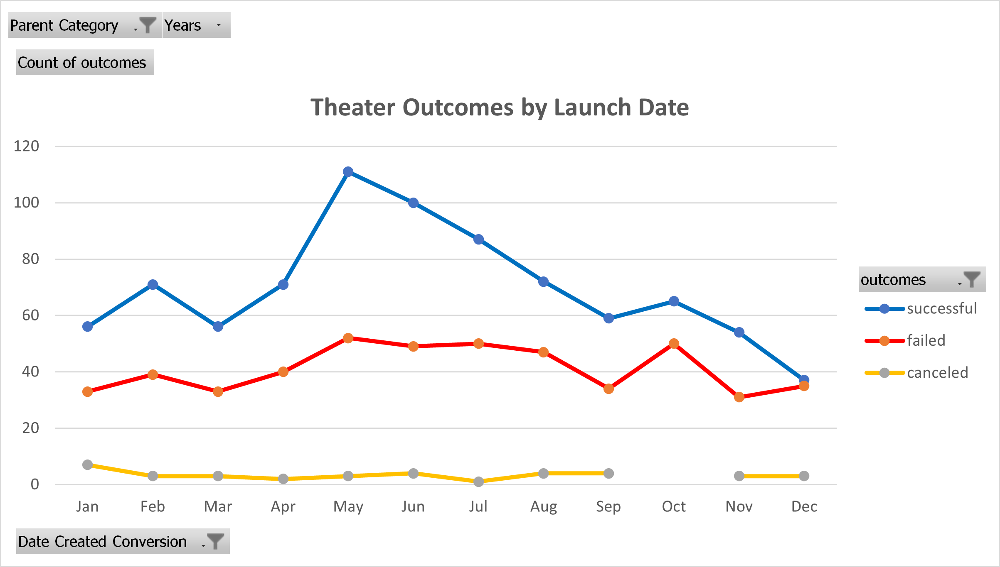
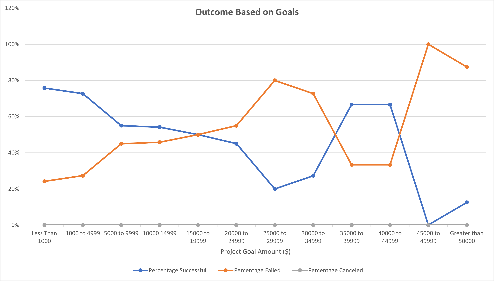

# kickstarter-analysis
## Overview of Project
Our Client, Louise, wants to know how different **Play** campaigns fared in relation to their launch dates and funding goals.

### Purpose
Analysing how each of these two parameters, **_campaign launch dates_** and **_their funding goals_**, can effect the **play** campaigns **outcomes** using data provided with the Kickstarter file.

## Analysis and Challenges
### Analysis of Outcomes Based on Launch Date

For this section, at first, I extracted the **Launch Year** out of our Launch date column with the =year() formula. Then, I created a PivotTable with _Parent Category_ and _Years_ as its _filters_, _Outcome_ as its _columns_ and _Date Conversion_ as its _rows_. Secondly, I set the filter of Parent Category to **Theater**. The result table shows us the number of Successful, Failed and Cancelled Theater Campagins for each month of year.

Our data shows that **theater play** fund raising campaigns can be more successful mid-year, _late spring / early summer_. The highest number of successful campaigns belong to month of **May** while the least successful campaigns were launched in **December**. 
The analysis also shows that beginning months of the year as well as end of the year, cannot be a good launch date for the theater play campaigns Launch date.

### Analysis of Outcomes Based on Goals

The data shows that play fund raising campaigns within following goal amount are tend to be more successful:
- **$4,999** or **less**  
- Between **$35,000** to **$40,000**

### Challenges and Difficulties Encountered
At the beginning with the Outcome based on Goals section of challenge, the numbers I received with my COUNTIF formulas were not the same as final results mentioned on challenge guideline. At first, I could not figure out what the problem is. However, once I started checking the challenge guidelines, I noticed that the results should have only included the **Theater Play campaigns**, not all campaigns. That is when I realised that in my COUNTIF formula, I need to add a condition to limit the results to only _play_ campaigns.  

## Results

- What are two conclusions you can draw about the Outcomes based on Launch Date?
Month of **May** has the highest number of successful fund raising campaigns whereas, **December** has the lowest number of succesful campaigns.

- What can you conclude about the Outcomes based on Goals? 
Based on our data, the higher funding goal of a campaign is, there will be a higher risk of failing for it. Also, we can see that the success rate declines as the goal amount increase. To conclude, Campaigns which have Funding goal of $4,999 and less have the highest success range.

- What are some limitations of this dataset?
There are other elements which can effect the success of a **Theater Play** like their genre. We also have some outliners which can cause ditruption to our analysis.

- What are some other possible tables and/or graphs that we could create?
  - Outcome based on Deadline or Duration of the Campaign
  - A box-whisker plot to have the outliners identified for each campaign parent category
